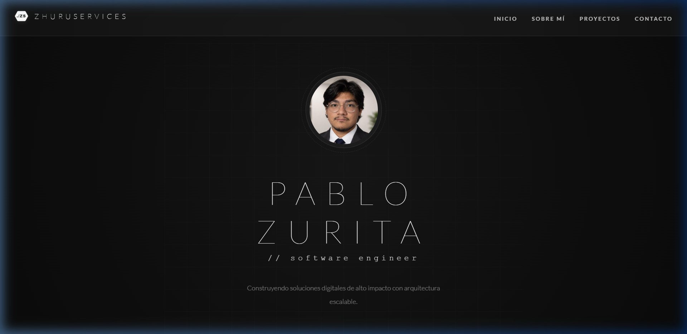
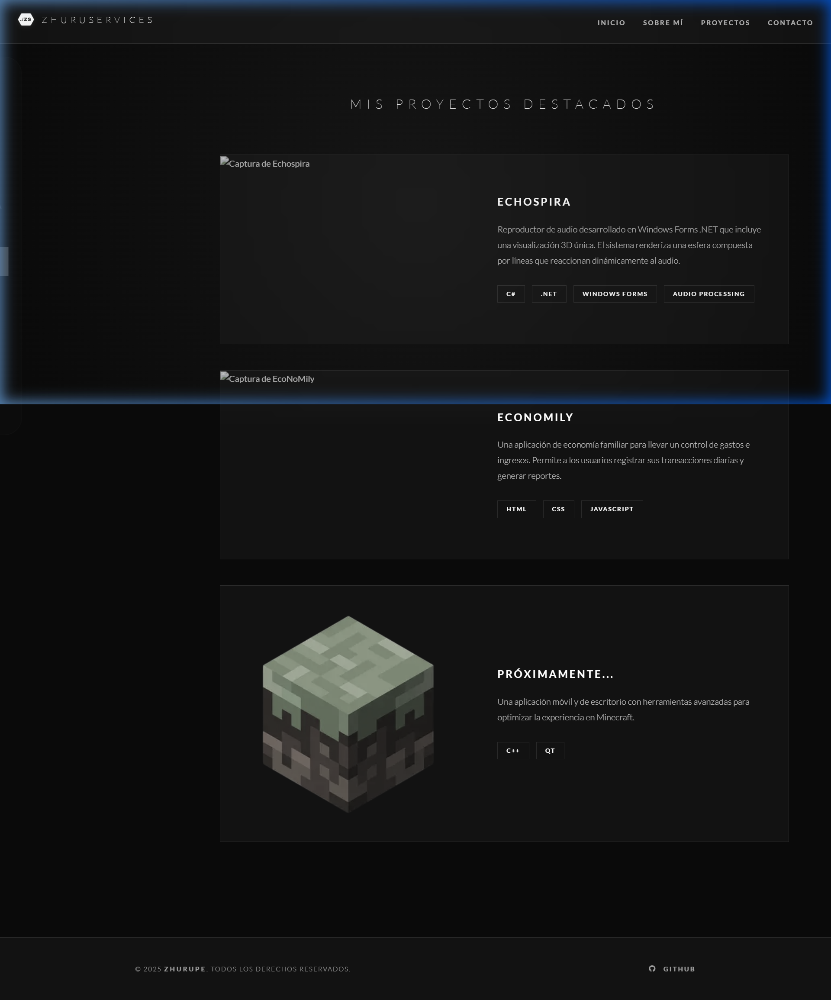
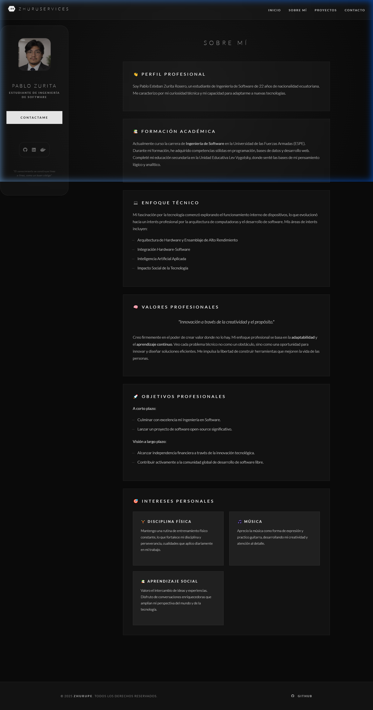
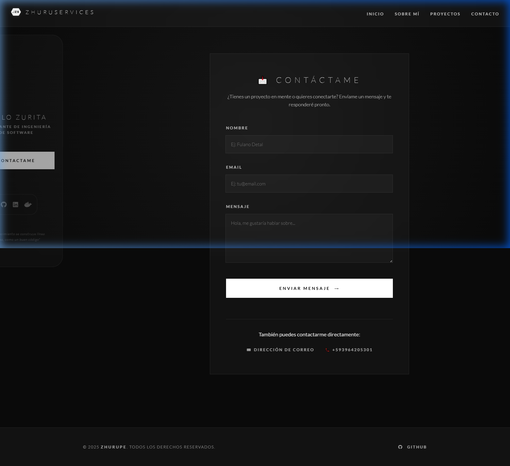

# Pablo Zurita | Software Engineer Portfolio



## 🚀 Sobre el Proyecto
Este proyecto es una **Landing Page Premium** diseñada para reflejar una identidad profesional de alto nivel en ingeniería de software. El diseño se aleja de las plantillas convencionales para adoptar una estética de "Arquitecto de Software", centrada en la precisión, la estructura y el rendimiento.

### 🎨 Temática: "Software Engineer Architect"
*   **Estética Monocromática:** Uso sofisticado de negros, grises y blancos para un look atemporal y profesional.
*   **Vibras de Ingeniería:** Inclusión de acentos de sintaxis (snake_case, comentarios de código, divisores técnicos) y tipografías monospaciadas.
*   **Glassmorphism Pro:** Efectos de cristal esmerilado con desenfoque de fondo y bordes de alta definición.
*   **Diseño Inmersivo:** Cuadrículas técnicas sutiles y animaciones cinemáticas de carga.

---

## 🛠️ Stack Tecnológico
*   **Framework:** [Angular 18+](https://angular.dev/) (Standalone Components).
*   **Reactividad:** Angular Signals (Estado reactivo ultra-rápido).
*   **Estilos:** Vanilla CSS con Arquitectura de Variables (Custom Properties).
*   **Animaciones:** CSS Animations & Transitions (Cubic-bezier curves).
*   **SEO:** Gestión dinámica de Title y Meta tags por componente.
*   **Rendimiento:** Implementación de `NgOptimizedImage` para LCP optimizado.
*   **Servicios:** Centralización de datos vía `ProjectService`.
*   **Contacto:** Integración directa con [EmailJS](https://www.emailjs.com/).

---

## ✨ Características Principales
*   **Contador de Experiencia Dinámico:** Cálculo en tiempo real de años de trayectoria basado en fecha de inicio.
*   **Catálogo de Proyectos Reactivo:** Número de proyectos sincronizado automáticamente con el servicio de datos.
*   **Sidebar Flotante:** Navegación minimalista estilo "glass-box" con estados de hover avanzados.
*   **Totalmente Responsivo:** Adaptabilidad perfecta desde monitores ultra-wide hasta dispositivos móviles.

---

## 📸 Galería del Proyecto

### Home (Engineer Vibes)


### Proyectos Dinámicos


### Perfil Profesional (Sobre Mí)


### Contacto e Interacción


---

## ⚙️ Instalación y Desarrollo

1.  **Clonar el repositorio:**
    ```bash
    git clone https://github.com/tu-usuario/LandingPage.git
    ```
2.  **Instalar dependencias:**
    ```bash
    npm install
    ```
3.  **Ejecutar en modo desarrollo:**
    ```bash
    ng serve
    ```
    Navega a `http://localhost:4200/`.

---

## 📄 Licencia
Este proyecto es de uso personal y educativo.

---
*Desarrollado con por Pablo Zurita*
